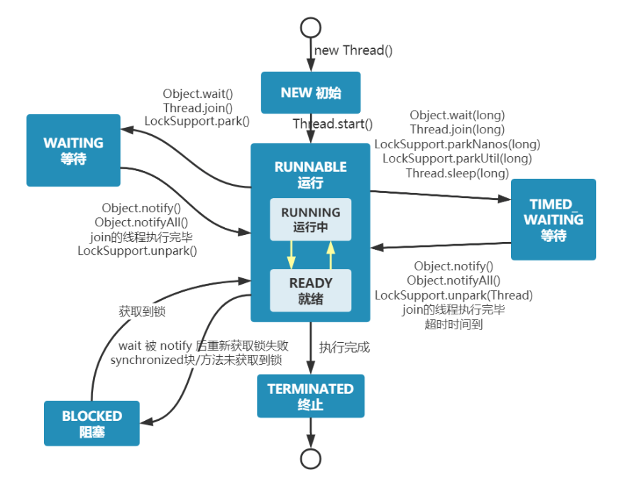
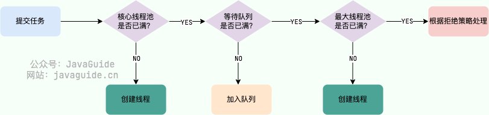

# Java

## 泛型 & 通配符

### 什么是泛型，有什么作用?
问题引入:  

一般的类和方法，只能使用具体的类型：要么是基本类型，要么是自定义的类。如果要编写可以应用于多种类型的代码，这种刻板的限制对代码的束缚就会很大。


泛型的本质是 **类型参数化** ，在不创建新的类型的情况下，通过**泛型指定的不同类型来控制形参具体限制的类型**
举个简单的例子
```java
public void printInteger(Integer[] intArrays){
    for (Integer intArray : intArrays) {
        System.out.println(intArray);
    }
}

public void printString(String[] stringArrays){
    for (String stringArray : stringArrays) {
        System.out.println(stringArray);
    }
}

public void printObject(T[] tArrays){
    for (T tArray : tArrays) {
        System.out.println(tArray);
    }
}
```

## 并发编程

### 线程的生命周期和状态
[文档参考 JavaGuide](https://javaguide.cn/java/concurrent/java-concurrent-questions-01.html)  

Java 线程在运行的生命周期中的指定时刻只可能处于下面 6 种不同状态的其中一个状态：  
NEW: 初始状态，线程被创建出来但没有被调用 start()。  
RUNNABLE: 运行状态，线程被调用了 start()等待运行的状态。  
BLOCKED：阻塞状态，需要等待锁释放。WAITING：等待状态，表示该线程需要等待其他线程做出一些特定动作（通知或中断）。  
TIME_WAITING：超时等待状态，可以在指定的时间后自行返回而不是像 WAITING 那样一直等待。  
TERMINATED：终止状态，表示该线程已经运行完毕。线程在生命周期中并不是固定处于某一个状态而是随着代码的执行在不同状态之间切换。



由上图可以看出：线程创建之后它将处于 NEW（新建） 状态，调用 start() 方法后开始运行，线程这时候处于 READY（可运行） 状态。可运行状态的线程获得了 CPU 时间片（timeslice）后就处于 RUNNING（运行） 状态。

当线程执行 wait()方法之后，线程进入 WAITING（等待） 状态。进入等待状态的线程需要依靠其他线程的通知才能够返回到运行状态。TIMED_WAITING(超时等待) 状态相当于在等待状态的基础上增加了超时限制，比如通过 sleep（long millis）方法或 wait（long millis）方法可以将线程置于 TIMED_WAITING 状态。当超时时间结束后，线程将会返回到 RUNNABLE 状态。当线程进入 synchronized 方法/块或者调用 wait 后（被 notify）重新进入 synchronized 方法/块，但是锁被其它线程占有，这个时候线程就会进入 BLOCKED（阻塞） 状态。线程在执行完了 run()方法之后将会进入到 TERMINATED（终止） 状态。

具体的用法

1.join

介绍：当执行到这个方法的时候会阻塞主线程， 直到调用这个方法的线程执行完毕，才会继续执行主线程。

入门案例
```java
Thread downloadThread = new Thread(() -> {
    System.out.println("子线程开始下载文件...");
    try {
        Thread.sleep(2000); // 模拟耗时操作
    } catch (InterruptedException e) {
        e.printStackTrace();
    }
    System.out.println("子线程下载完成！");
});
downloadThread.start();
System.out.println("主线程等待子线程下载...");
downloadThread.join(); // 主线程阻塞，直到downloadThread执行完毕
System.out.println("主线程继续执行（比如处理下载的文件）");

// 运行结果
主线程等待子线程下载...
子线程开始下载文件...
子线程下载完成！
主线程继续执行（比如处理下载的文件）
```
进阶案例 实现多线程交替打印从0到100  

核心机制就是利用yihai
```java 

```

可重入锁的实现 lock
```java 
public class PrintABCUsingLock  {

    private int times; // 控制打印次数
    private int state;   // 当前状态值：保证三个线程之间交替打印
    private Lock lock = new ReentrantLock();

    public PrintABCUsingLock (int times) {
        this.times = times;
    }

    private void printLetter(String name, int targetNum) {
        for (int i = 0; i < times; ) {
            lock.lock();
            if (state % 3 == targetNum) {
                state++;
                i++;
                System.out.print(name);
            }
            lock.unlock();
        }
    }

    public static void main(String[] args) {
        PrintABCUsingLock  loopThread = new PrintABCUsingLock (3);

        new Thread(() -> {
            loopThread.printLetter("B", 1);
        }, "B").start();

        new Thread(() -> {
            loopThread.printLetter("A", 0);
        }, "A").start();

        new Thread(() -> {
            loopThread.printLetter("C", 2);
        }, "C").start();
    }
}
```
wait和notify的实现 通用对象
```java 
public class PrintABCUsingWaitNotify {

    private int state;
    private int times;
    private static final Object LOCK = new Object();

    public PrintABCUsingWaitNotify(int times) {
        this.times = times;
    }

    public static void main(String[] args) {
        PrintABCUsingWaitNotify printABC = new PrintABCUsingWaitNotify(10);
        new Thread(() -> {
            printABC.printLetter("A", 0);
        }, "A").start();
        new Thread(() -> {
            printABC.printLetter("B", 1);
        }, "B").start();
        new Thread(() -> {
            printABC.printLetter("C", 2);
        }, "C").start();
    }

    private void printLetter(String name, int targetState) {
        for (int i = 0; i < times; i++) {
            synchronized (LOCK) {
                while (state % 3 != targetState) {
                    try {
                        LOCK.wait();
                    } catch (InterruptedException e) {
                        e.printStackTrace();
                    }
                }
                state++;
                System.out.print(name);
                LOCK.notifyAll();
            }
        }
    }
}
```
### 线程池

#### 为什么要有线程池
线程池: 管理一系列线程的资源池

这里借用《Java 并发编程的艺术》提到的来说一下使用线程池的好处：
* 降低资源消耗。通过重复利用已创建的线程降低线程创建和销毁造成的消耗。
* 提高响应速度。当任务到达时，任务可以不需要等到线程创建就能立即执行。
* 提高线程的可管理性。线程是稀缺资源，如果无限制的创建，不仅会消耗系统资源，还会降低系统的稳定性，使用线程池可以进行统一的分配，调优和监控。

#### 创建线程的核心参数

```java 
ThreadPoolExecutor threadPoolExecutor = new ThreadPoolExecutor(
        7, //核心线程数
        14, //最大线程数
        100,  //最大线程数 > 核心线程数的那部分线程在没有任务的时候的最多存活时间
        TimeUnit.SECONDS, // 时间的单位
        new ArrayBlockingQueue<>(10), //队列，用来存放核心线程数满以后的任务
        new NamingThreadFactory("normal"), //线程工厂，用来创建线程
        new ThreadPoolExecutor.AbortPolicy()); //拒绝策略  
```
其中 核心线程默认不会回收，没有任务就处在waiting状态

#### 线程池处理任务的流程

* 如果当前运行的线程数小于核心线程数，那么就会新建一个线程来执行任务。 
* 如果当前运行的线程数等于或大于核心线程数，但是小于最大线程数，那么就把该任务放入到任务队列里等待执行。
* 如果向任务队列投放任务失败（任务队列已经满了），但是当前运行的线程数是小于最大线程数的，就新建一个线程来执行任务。
* 如果当前运行的线程数已经等同于最大线程数了，新建线程将会使当前运行的线程超出最大线程数，那么当前任务会被拒绝，拒绝策略会调用RejectedExecutionHandler.rejectedExecution()方法。

#### 不推荐默认线程池的理由
* FixedThreadPool 和 SingleThreadExecutor:使用的是阻塞队列 LinkedBlockingQueue，任务队列最大长度为 Integer.MAX_VALUE，可以看作是无界的，可能堆积大量的请求，从而导致 OOM。
* CachedThreadPool:使用的是同步队列 SynchronousQueue, 允许创建的线程数量为 Integer.MAX_VALUE ，如果任务数量过多且执行速度较慢，可能会创建大量的线程，从而导致 OOM。
* ScheduledThreadPool 和 SingleThreadScheduledExecutor:使用的无界的延迟阻塞队列DelayedWorkQueue，任务队列最大长度为 Integer.MAX_VALUE,可能堆积大量的请求，从而导致 OOM。

```java 
public static ExecutorService newFixedThreadPool(int nThreads) {
    // LinkedBlockingQueue 的默认长度为 Integer.MAX_VALUE，可以看作是无界的
    return new ThreadPoolExecutor(nThreads, nThreads,0L, TimeUnit.MILLISECONDS,new LinkedBlockingQueue<Runnable>());

}

public static ExecutorService newSingleThreadExecutor() {
    // LinkedBlockingQueue 的默认长度为 Integer.MAX_VALUE，可以看作是无界的
    return new FinalizableDelegatedExecutorService (new ThreadPoolExecutor(1, 1,0L, TimeUnit.MILLISECONDS,new LinkedBlockingQueue<Runnable>()));

}

// 同步队列 SynchronousQueue，没有容量，最大线程数是 Integer.MAX_VALUE`
public static ExecutorService newCachedThreadPool() {

    return new ThreadPoolExecutor(0, Integer.MAX_VALUE,60L, TimeUnit.SECONDS,new SynchronousQueue<Runnable>());

}

// DelayedWorkQueue（延迟阻塞队列）
public static ScheduledExecutorService newScheduledThreadPool(int corePoolSize) {
    return new ScheduledThreadPoolExecutor(corePoolSize);
}
public ScheduledThreadPoolExecutor(int corePoolSize) {
    super(corePoolSize, Integer.MAX_VALUE, 0, NANOSECONDS,
          new DelayedWorkQueue());
}
```
#### 常见拒绝策略
