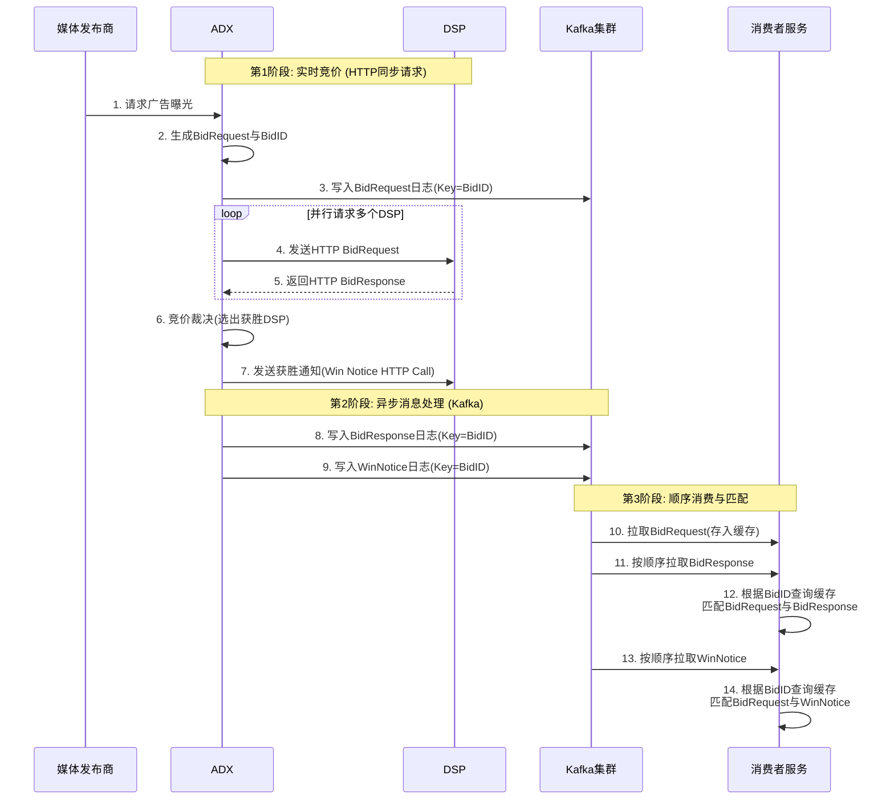

# kafka

## 1.入门和核心概念介绍

### 1.队列模型


我们先从 Kafka 的基础模型说起。简单来看，Kafka 扮演着 “消息中转站” 的角色：生产者（producer）将消息发送到 Kafka，消费者（consumer）再从 Kafka 中获取消息进行处理，Kafka 就是连接两者的中间消息队列。

### 2.订阅发布模型


但 Kafka 的核心是**发布 - 订阅模型**，而非简单的队列。具体来说，生产者会将消息发送到特定的 “主题（topic）” 中，消费者则从主题中消费数据。它与普通队列的关键区别在于：**多个消费者可以同时订阅同一个主题**，这意味着同一条消息能被多个消费者分别处理。

举个实际场景的例子：电商公司会将用户的行为数据（如点击、加购等）发送到 Kafka 的某个主题中，此时行为监测模块需要分析用户行为轨迹，商品推荐模块需要基于行为数据生成推荐，这两个模块就可以作为不同的消费者，同时从该主题中获取消息，各自完成业务处理。

### 3.核心概念


要进一步理解 Kafka 的高可用性，需要先明确几个核心概念 —— 这些概念的引入，本质是将 Kafka 的单个节点扩展为多节点集群，提升系统的可靠性和效率：

1. **代理（broker）**
   可以简单理解为一个独立的 Kafka 服务实例，每个 broker 内部包含多个主题（topic），多个 broker 共同组成 Kafka 集群。
2. **分区（partition）**
   主题（topic）是生产者和消费者指定的 “外层标识”，其内部由多个分区组成。例如，一个主题包含 2 个分区时，若生产者发送 100 条消息，理想情况下每个分区会各存储 50 条（实际分配可能受消息键值影响，但此处简化理解）。分区的作用是实现消息的 “分片存储”，为后续并发处理奠定基础。
3. **消费者组（consumer group）**
   发布 - 订阅模型中的 “消费者” 实际以 “消费者组” 为单位工作：一个消费者组由多个消费者组成，可共同并发消费某个主题的消息。
   这里的关键逻辑是：**一个消费者可负责消费一个或多个分区，但一个分区只能被同一个消费者组内的一个消费者消费**。这意味着若主题有 2 个分区，而消费者组有 3 个消费者，就会有 1 个消费者处于空闲状态。因此，配置时通常需要保证 “主题的分区数 ≥ 消费者组内的消费者数”，以充分利用并发能力。
4. **副本（Replica）**
   副本是分区的 “备份”，用于保证数据可靠性。例如，副本数为 3 时，一个分区的数据会有 3 份（如分区 1 的副本 1-1、1-2、1-3），且这 3 份数据完全一致。
   - 副本中会选举出一个 “leader”（如 1-1），其余为 “follower”（如 1-2、1-3）。生产者发送消息时，只会将数据写入 leader，follower 则后台同步 leader 的数据。
   - 消息写入的确认机制由参数`acks`控制：`acks=0`表示消息发送后立即认为成功（不等待确认）；`acks=1`表示仅 leader 写入成功即返回；`acks=all`表示需要 leader 和所有 “ISR（已同步副本集合）” 中的 follower 都写入成功才返回。
   - ISR 是指与 leader 保持 “高度同步” 的副本集合（包含 leader 自身和健康的 follower）。Kafka 通过`replica.lag.time.max.ms`参数判断 follower 是否健康：若 follower 同步滞后时间超过该阈值，会被移出 ISR。
   - 消费者仅从 leader 消费消息，消费完成后会提交一个 “offset”（消息偏移量）给 leader，由 leader 管理；follower 不参与消费过程，仅负责数据同步。（注：副本的选举与管理涉及 Kraft 算法，本文暂不展开，感兴趣可进一步了解。）

最后，我们看看多 broker 集群中，分区和副本是如何存储的。
假设存在 10 个 broker、5 个主题，每个主题包含 10 个分区，副本数为 3：

- 总副本数为：5（主题）×10（分区 / 主题）×3（副本 / 分区）=150 个；
- 平均到 10 个 broker 上，每个 broker 会存储 150÷10=15 个副本。

若没有副本（即副本数 = 1），总分区数为 5×10=50 个，显然 15＜50，这说明每个 broker 只会存储部分分区的副本，而非全部数据。
这种设计体现了 “分治思想”：整个集群通过多个 broker 分担存储和处理压力，既保证了数据的分布式存储，又提升了系统的容错能力和扩展性。


----

图片来源：

Javaguide：https://javaguide.cn/high-performance/message-queue/kafka-questions-01.html

利志分享：微信公众号

## 2.Kafka常见生产问题汇总

### 1.Kafka如何保证消息的消费顺序

回答这个问题，可以先从Kafka的消息消费为什么通常是无序的讲起，生产者指定topic发送消息，对于Kafka来说消息是存放在分区Partition中，一般在生产环境中会有多个Partition，往某个topic发送消息就可能导致消息发送到不同的分区中，又因为消费者消费消息的速度是不相同的，从而就会导致原本顺序发送的消息但是消费却不是按照顺序的。

一般常见的解决方法有两种

1.创建topic的时候只指定一个分区，这样只要保证生产者发送的消息有序，那么在这个分区中所有的消息都会是有序的了，但是但分区有明显的性能瓶颈，只有一个消费者能消费这个消息，无法利用broker进行多分区并行消费，如果topic的吞吐量qps达到上万，对可能会导致消息堆积。

2.消费者发送消息的时候可以指定一个key，这个key需要保证顺序消息的始终唯一，对于相同的key，Kafka就会放到同一个分区中，又因为Kafka中同一个分区只能由一个消费者消费，所以可以保证消息消费的有序性，实际开发中也需要保证key值不能为null否则会用轮询的方式分配分区，导致顺序混乱。

在实际的项目开发中也遇到过需要保证消息顺序消费的情况，在程序化广告的RTB竞价请求中，媒体会先把一些用户设备，app的信息传过来，然后我们平台请求渠道，得到广告返回的价格，在这个环节中要往kafka中发三条消息，1.媒体的入参信息 2.对应这该媒体的渠道的广告返回价格 3.发送竞价成功的通知。这三条消息需要保证有序，因为是现有媒体的请求，再有广告返回的价格，最后是竞价成功的通知。如果现有广告返回的价格而没有媒体的请求信息，那广告返回价格的信息这条消息就消费不下去了。



### 2.Kafka如何保证消息不丢失

Kafka保证消息不丢失一共可以从3个角度去分析。生产者消息不丢失，消费者消息不丢失，Kafka本身消息不丢失

#### 生产者消息不丢失

可以通过Kafka的代码设置重试设置一个while循环，设置最大循环次数和每次重试的间隔时间，来确保消费者的信息不丢失
```java
   private final KafkaTemplate<String, Object> kafkaTemplate;
    // 最大重试次数（代码端）
    private static final int MAX_RETRY_COUNT = 3;
    // 重试间隔时间（毫秒）
    private static final long RETRY_INTERVAL_MS = 1000;

    public KafkaMessageProducer(KafkaTemplate<String, Object> kafkaTemplate) {
        this.kafkaTemplate = kafkaTemplate;
    }

    /**
     * 发送消息并支持重试
     * @param topic 主题名
     * @param message 消息内容
     * @return 是否发送成功
     */
    public boolean sendWithRetry(String topic, Object message) {
        int retryCount = 0;
        while (retryCount < MAX_RETRY_COUNT) {
            try {
                ListenableFuture<SendResult<String, Object>> future = kafkaTemplate.send(topic, message);
                
                // 同步阻塞等待结果（也可保持异步，但重试逻辑需调整为异步回调中处理）
                SendResult<String, Object> result = future.get(5, TimeUnit.SECONDS);
                
                logger.info("生产者成功发送消息到topic:{} partition:{}，offset:{}",
                        result.getRecordMetadata().topic(),
                        result.getRecordMetadata().partition(),
                        result.getRecordMetadata().offset());
                return true;
            } catch (Exception e) {
                retryCount++;
                logger.error("第{}次发送消息到topic:{}失败，原因：{}", retryCount, topic, e.getMessage());
                
                // 如果未达到最大重试次数，等待后重试
                if (retryCount < MAX_RETRY_COUNT) {
                    try {
                        Thread.sleep(RETRY_INTERVAL_MS);
                    } catch (InterruptedException ie) {
                        Thread.currentThread().interrupt();
                        break; // 中断时停止重试
                    }
                }
            }
        }
        
        logger.error("消息发送失败，已达到最大重试次数{}次，topic:{}，消息:{}", 
                MAX_RETRY_COUNT, topic, message);
        // 此处可添加消息持久化到本地（如数据库/文件）的逻辑，避免彻底丢失
        return false;
    }
```

也可以通过Kafka本身的重试来确保生产者的消息不丢失，通过设置producer.retries=3在kafka的内部进行消息重试，起到一个双重保险的效果，确保Kafka的消息不丢失

#### 消费者消息不丢失/重复消费问题

Kafka的消息消费默认是消费者接收到消息的时候就自动提交offset，提交offset就代表者这个消息被消费了，但实际在业务中收到消息了以后，可以消费的时候代码出问题了，比如抛出异常啥的，导致消息没有真正的消费，所以我们可以手动提交offset，确保消费者消息不丢失，但手动提交offset会有可能会导致重复消费，比如服务端消费时间过长或者网络波动触发分区rebalance，从而导致同一条消息被消费两次，对于这种情况，可以在服务端做一些幂等性的校验比如 Redis 的 set、MySQL 的主键等天然的幂等。

减少分区rebalance的频率：合理设置 `session.timeout.ms` 和 `heartbeat.interval.ms`，避免消费者因 “偶尔卡顿” 被判定为下线）

总结一下

如果自动提交offset，可能会导致消息丢失，但是可以设置定时任务在业务不繁忙的时候(通常是凌晨)做一个业务兜底

如果手动提交offset，可能会导致消息重复消费，但是可以通过幂等性的校验如Redis 的 set、MySQL 的主键等天然的幂等来防止重复消费。

在公司里用的都是手动提交offset，利用每次媒体请求的请求id都是全局唯一的特性，在数据库的幂等性做校验。

#### Kafka内部弄丢了消息

Kafka 为分区（Partition）引入了多副本（Replica）机制，分区中的多个副本之中只会有1个leader和多个follower，生产者和消费者都是直接和leader交互，然后leader将数据同步到follower中，如果因为网络波动，leader所在的broker挂了，就会导致leader下线，但是其余的副本如果数据并未及时同步leader的数据，而且在下一次的选举中被选举为leader，那么就会导致数据出现丢失

对于这类问题，解决的方式一般都是修改Kafka的配置参数来实现。
1.副本数的配置，每个分区的副本数最好大于等于3，假如没有副本数，那单独的一个Broker服务挂了，全部消息都用不了了。

2.设置同步数acks=all，这个参数指的是当生产者的消息发送到topic的时候，leader接受到了消息，并且所有ISR副本接受到了消息，才被认定为消费接受成功，其中ISR副本指的是最近同步过的副本，如果副本长时间未同步，或者服务掉线则不会在ISR副本中，所以设置acks=all可以确保消息在所有的副本中都能接受到 

3.设置副本最少写入数 min.insync.replicas=2，指的是消息至少被两个副本写入否则则会报错，一般这个参数的设置值是等于副本数减一，因为需要确保kafka的高可用，如果刚好等于副本数，那么有一个副本下线了，整个kafka就用不了了，对于实际开发，也是不合适的。这个参数和前面acks=all参数的区别是Kafka对于消息的接收和写入和分两部分的，acks确保副本都能接收，最小同步数设置至少的写入量，同时可以设置unclean.leader.election.enable = false，这个参数可以指定当leader发生故障的时候只会选怎副本同步最近的当leader，当然这个参数在kafka2版本以后已经是一个默认的参数配置了。

「ISR 副本（In-Sync Replica，指与 Leader 保持数据同步的副本）」

「Rebalance（分区重平衡，指消费者组内成员变化时，重新分配分区的过程）」

### 3.实际开发中的问题排查顺序

比如消息丢失
1. 查生产者日志：看是否有 “发送失败 + 重试耗尽” 的日志，判断是否是生产者端问题；
2. 查 Kafka 监控：通过 Kafka Manager 或 Prometheus 查看 “ISR 副本数”“Leader 切换次数”，判断是否是副本同步问题；
3. 查消费者日志：看 “Offset 提交状态” 和 “幂等校验失败日志”，判断是否是消费端未提交或重复消费。


