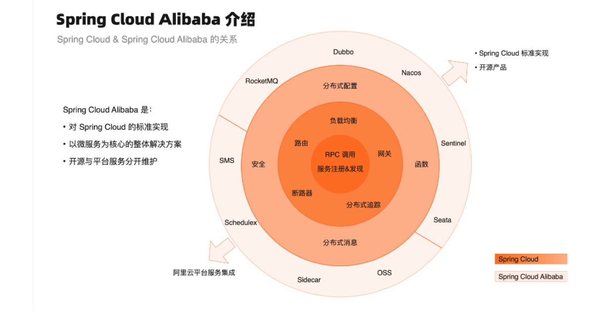
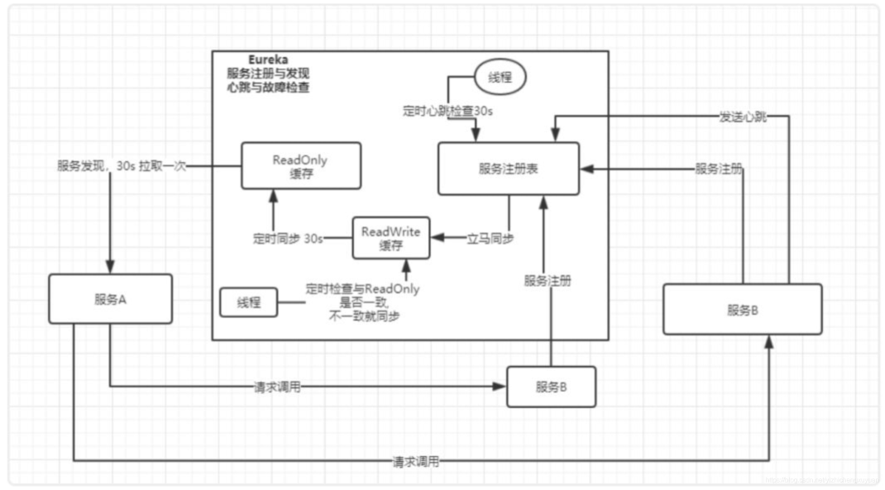
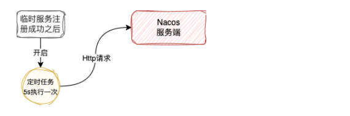
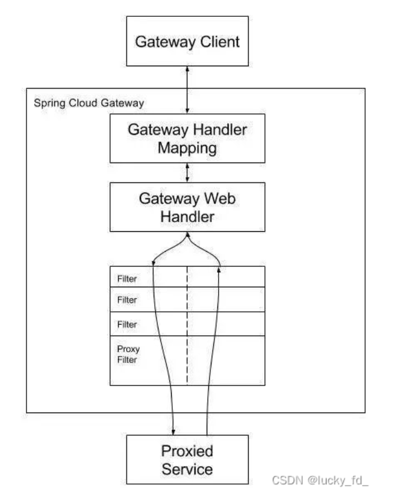

# 微服务常用组件
暂定2月23日之前完成文档
## 微服务介绍
微服务架构是一种架构模式，它体长将单一的应用程序划分成一组小的服务，每个服务运行在其独立的自己的进程内，服务之间互相协调，采用轻量级的通信机制(HTTP)互相沟通。各个服务能够被独立的部署到生产环境中，应尽量避免统一的，集中式的服务管理机制，但可以有一个非常轻量级的集中式管理来协调这些服务。

从技术层面理解：

微服务化的核心就是将传统的一站式应用，根据业务拆分成一个一个的服务，彻底地去耦合，每一个微服务提供单个业务功能的服务，一个服务做一件事情，从技术角度看就是一种小而独立的处理过程，类似进程的概念，能够自行单独启动或销毁，拥有自己独立的数据库。

常见微服务项目的整体架构


Spring Cloud Alibaba 的介绍


## 常见FAQ
1.Spring Cloud Alibaba 和 Spring Cloud、Spring Cloud Netflix 的区别在哪？

Spring Cloud：Spring 官方提供的分布式应用开发的一套共用模式，也可以理解成一套微服务开发的统一的抽象编程模型。  
Spring Cloud Netflix：基于 Spring Cloud 编程模型实现的微服务框架，是最早期的微服务框架。近年来，Netflix 宣布大多数组件停止维护。  
Spring Cloud Alibaba：Alibaba 提供的基于 Spring Cloud 编程模型实现的微服务框架，其所有组件都来自于阿里巴巴微服务技术，无论是解决方案完整性、技术成熟度、社区还是文档资料等都对国内开发者非常友好。

## 常用组件和原理介绍
本片文章会从根据SpringCloudAlibaba的服务入手，讲讲各个生态的常用组件   
官方地址 https://sca.aliyun.com/docs/2023/overview/what-is-sca  

组件可以分为 7种 
着重讲的 
* 注册配置中心
* 限流降级
* 网关

省略讲的  
* 分布式定时任务

不讲/分到别的模块讲的
* 分布式消息 mq相关 (单独开一个模块讲)
* 异构服务 (短时间没什么用，除了大厂一般用不到)
* 静态编译 (了解即可)

## 注册配置中心

### 注册配置中心的作用
微服务的架构的核心思想是将系统拆分成多个独立的服务，高内聚，低耦合  
比如一个微服务有abc三个子服务,分别启动在同一服务器的8081，8082，8083的端口上，而进程之间是不可以相互通信的，如果要访问其他模块的接口一般是采用http协议  
a项目想调用b项目的接口，发送http请求，访问127.0.0.1:8082/goods/insertOne (调用了商品模块的增加接口)  
注册中心就是将服务注册起来，形成一个注册表，让a项目调用的时候不用关系b的ip地址和端口，而是根据应用名来访问 采用了注册中心之后 就可以通过projectGoods/goods/insertOne来实现远程调用了，注册中心会自动找到要访问哪台服务器的，里面也有负载均衡的逻辑实现。

注册中心要关注的重点是 服务注册与发现
这里主要介绍 nacos1.x和nacos2.x和eruka的异同

### eureka 介绍
* EurekaServer启动的时候注册自己的IP端口服务名称等信息
* EurekaClient作为java客户端，在服务启动后周期性的（默认30s）向EurekaServer发送心跳
* EurekaServer在一定时间（默认90s）没有收到某个服务的心跳就会注销该实例，EurekaClient发送canel命令后也会注销该实例
* EurekaServer之间会相互复制注册表信息
* EurekaClient会缓存注册表信息 (二级缓存),从EurekaServer中拉取(默认30s)
* EurekaServer的自我保护机制，如果15分钟内超过85%的客户端节点都没有正常的心跳，Eureka就会认为客户端与注册中心出现了网络故障，然后将实例保护起来，不让他们立即过期
* EurekaClient发送cancel命令后，EurekaServer会立即注销该实例

eureka的架构图


### nacos 介绍

引入概念  
临时实例和永久实例  

临时实例(偏业务)  
临时实例在注册到注册中心之后仅仅只保存在服务端内部一个缓存中，不会持久化到磁盘  
这个服务端内部的缓存在注册中心届一般被称为服务注册表  
当服务实例出现异常或者下线之后，就会把这个服务实例从服务注册表中剔除  

永久实例(偏运维)  
永久服务实例不仅仅会存在服务注册表中，同时也会被持久化到磁盘文件中  
当服务实例出现异常或者下线，Nacos 只会将服务实例的健康状态设置为不健康，并不会对将其从服务注册表中剔除  
所以这个服务实例的信息你还是可以从注册中心看到，只不过处于不健康状态  

1.实例的区分异同
在 1.x 版本中，一个服务中可以既有临时实例也有永久实例，服务实例是永久还是临时是由服务实例本身决定的  
但是 2.x 版本中，一个服务中的所有实例要么都是临时的要么都是永久的，是由服务决定的，而不是具体的服务实例  


2.实例的通信协议异同  
在nacos1.x中，由http实现，nacos客户端定时往nacos服务端发送消息  
在nacos2.x中，由grpc实现，nacos客户端和nacos服务端之间建立长连接，通过长连接进行通信  
在nacos2.x中，会将临时实例的信息存储到客户端中的缓存中，重新建立连接注册服务端的时候的redo操作  

3.心跳实现  
在 1.x 中，心跳机制实现是通过客户端和服务端各存在的一个定时任务来完成的  
在服务注册时，发现是临时实例，客户端会开启一个 5s 执行一次的定时任务  

在 Nacos 服务端也会开启一个定时任务，默认也是 5s 执行一次，去检查这些服务实例最后一次心跳的时间，也就是客户端最后一次发送 Http 请求的时间  
当最后一次心跳时间超过 15s，但没有超过 30s，会把这服务实例标记成不健康    
当最后一次心跳超过 30s，直接把服务从服务注册表中剔除  


在 2.x 中，由于通信协议改成了 gRPC，客户端与服务端保持长连接，所以 2.x 版本之后它是利用这个 gRPC 长连接本身的心跳来保活  
如果连接断开，就从注册表中剔除  
Nacos 服务端也会启动一个定时任务，默认每隔 3s 执行一次，这个任务会去检查超过 20s 没有发送请求数据的连接

4.健康检查机制(针对永久实例)  
1.x和2.x版本实现机制相同，是由服务端向客户端发请求(tcp,http,mysql[通过执行sql来判断是否健康]),一般是tcp  

相关文档参考  
1.eureka 底层 推荐网页 https://blog.csdn.net/yizhichengxuyuan/article/details/107539963  
2.nacos 底层 推荐网页 https://blog.csdn.net/agonie201218/article/details/135828043  

## 网关
### 分布式网关的作用
1.路由和负载均衡 (最主要)  
2.安全与认证  
3.流量请求和熔断  
4.请求和响应的处理  
5.监控与日志    
6.服务解耦  

### Spring Cloud Gateway
网关的核心逻辑就是路由转发，执行过滤器链。  
```text
1. 客户端请求
   │
   ▼
2. Gateway Handler Mapping（路由匹配）
   │
   ▼
3. Gateway Web Handler（构建过滤器链）
   │
   ▼
4. Pre 过滤器（按 Order 顺序执行）
   │
   ▼
5. 转发请求到下游服务
   │
   ▼
6. Post 过滤器（按 Order 顺序执行）
   │
   ▼
7. 返回响应给客户端
```
如果使用配置类实现，pre和post是写在一个方法中的，通过 chain.filter(exchange) 作为区分，顺序就是写代码的从上到下实现。

执行原理 架构图


``` yaml 
# 参考相关的配置 yaml 形式
spring:
  application:
    name: api-gateway
  cloud:
    gateway:
      # 全局默认过滤器（作用于所有路由）
      default-filters:
        - AddRequestHeader=X-Global-Header, global-value  # 添加全局请求头
        - DedupeResponseHeader=Access-Control-Allow-Origin  # 去重响应头
      # 路由配置（核心部分）
      routes:
        # 路由1：基础路径匹配 + 服务发现
        - id: user-service-route  # 路由唯一ID
          uri: lb://user-service  # 目标服务地址（lb://表示负载均衡）
          predicates:
            - Path=/api/users/**  # 路径匹配
            - Method=GET,POST     # 请求方法匹配
            - Header=X-Request-Id, \d+  # 请求头匹配（正则）
            - After=2023-01-01T00:00:00.000+08:00  # 时间匹配
          filters:
            - StripPrefix=2  # 去除前缀（/api/users/foo → /foo）
            - AddRequestHeader=X-User-Source, gateway  # 添加请求头
            - AddResponseHeader=X-Response-Time, $(currentTimestamp)  # 添加响应头（需自定义过滤器）
            - RewritePath=/api/(?<segment>.*), /$\{segment}  # 路径重写
            - Retry=3  # 重试次数（默认GET方法）
            - name: RequestRateLimiter  # 限流过滤器
              args:
                redis-rate-limiter.replenishRate: 10  # 每秒令牌数
                redis-rate-limiter.burstCapacity: 20  # 最大突发容量
                key-resolver: "#{@ipKeyResolver}"  # 限流键解析器（需自定义Bean）

        # 路由2：简化 常用配置
        - id: order-service-route
          uri: lb://order-service
          predicates:
            - Path=/api/orders/**
      # 跨域配置 也可以放在一个配置类中 继承 GlobalFilter, Ordered
      globalcors:
        cors-configurations:
          '[/**]':
            allowedOrigins: "*"
            allowedMethods:
              - GET
              - POST
              - PUT
              - DELETE
            allowedHeaders: "*"
            maxAge: 3600
```
```java 
// 采用链式的规则的代码方式配置 
/**
 * 跨域过滤器
 */
public class CorsFilter implements GlobalFilter, Ordered {

    @Override
    @SuppressWarnings("serial")
    public Mono<Void> filter(ServerWebExchange exchange, GatewayFilterChain chain) {
        return chain.filter(exchange).then(Mono.defer(() -> {
            exchange.getResponse().getHeaders().entrySet().stream()
                    .filter(kv -> (kv.getValue() != null && kv.getValue().size() > 1))
                    .filter(kv -> (kv.getKey().equals(HttpHeaders.ACCESS_CONTROL_ALLOW_ORIGIN)
                            || kv.getKey().equals(HttpHeaders.ACCESS_CONTROL_ALLOW_CREDENTIALS)))
                    .forEach(kv ->
                    {
                        kv.setValue(new ArrayList<String>() {{
                            add(kv.getValue().get(0));
                        }});
                    });

            return chain.filter(exchange);
        }));
    }

    @Override
    public int getOrder() {
        return NettyWriteResponseFilter.WRITE_RESPONSE_FILTER_ORDER + 1;
    }
}
```

### Higress
适配k8s，不太好配环境，暂时不学

## 限流降级 + 监控
// TODO 明天再写
### Sentinel
### Hystrix