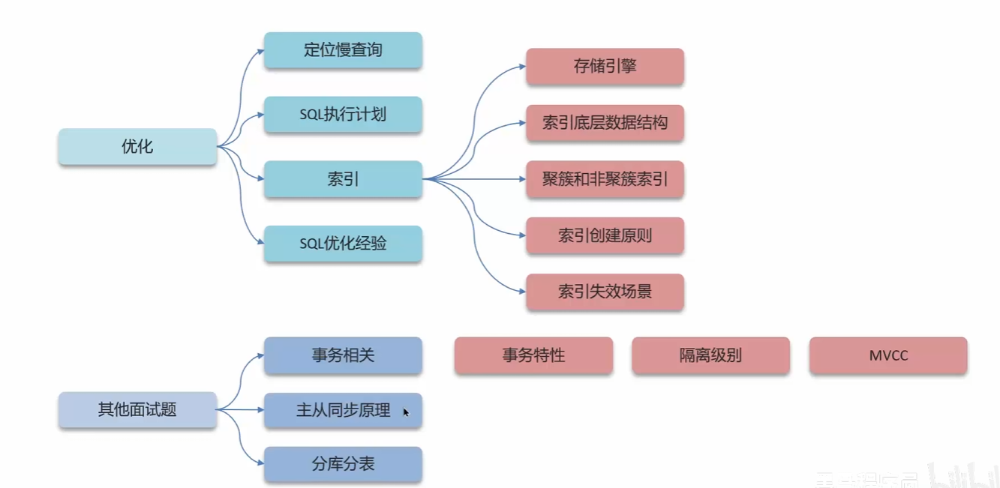
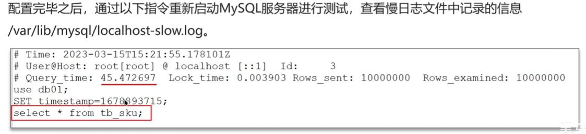
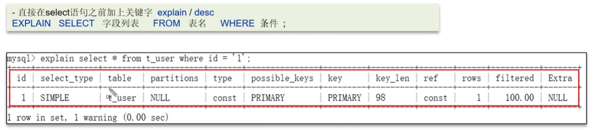

# Mysql

## 总结

本文档记录的主要有 **常见八股文** + **底层的原理** + **SQL优化案例汇总**

主要是根据黑马程序员的b站视频的mysql部分进行总结，对底层相关进行进一步分析

总体架构如下


## 如何定位慢查询

常见查询比较慢的场景
* 聚合查询
* 多表查询
* 表数据量过大查询
* 深度分页查询

具体现象：页面加载过慢，接口压测的响应时间过长 (1s)

方法一:开源工具
* 调试工具: Arthas
* 运维工具: Prometheus、SkyWalking

方法二: Mysql自带的慢日志
慢日志查询记录了所有执行时间超过指定参数(long_query_time,单位:秒,默认10s)的所有sql日志
如果要开启慢查询日志，选哟在Mysql的配置文件(/etc/my.cnf)中配置

```sql
# 开启慢日志查询的开关
slow_query_logs = 1
# 设置慢日志查询的时间,超过这个时间就放到slow.log中
long_query_time = 2
```


标准回答  
1.介绍以下当时产生问题的场景(我们当hi的一个接口测试的时候非常的慢，压测的结果大概5秒钟)  
2.我们系统中当时采用了运维工具Skywalking，可以检测出哪个接口，最后因为是sql的原因  
3.在mysql中开启了慢日志擦汗寻，我们设置的值就是2秒，一旦sql执行超过2秒就会记录道日志中  

## 如何分析慢查询

可以通过explain命令获取mysql如何执行select的信息



主要字段分析
* possible_key 当前sql可能会使用到的索引 (不用管这个)
* key 当前sql实际命中的索引
* key_len 索引占用的大小 (一般看这两个查看是否可能会命中索引)
* extra 额外的优化建议 (主要是针对要不要回表查询)
* type 这跳sql的链接的类型，性能由好到差为null、system、const、eq_ref、ref、range、index、all
> system：如果表使用的引擎对于表行数统计是精确的（如：MyISAM），且表中只有一行记录的情况下，访问方法是 system ，是 const 的一种特例。   
> const：表中最多只有一行匹配的记录，一次查询就可以找到，常用于使用主键或唯一索引的所有字段作为查询条件。  
> eq_ref：当连表查询时，前一张表的行在当前这张表中只有一行与之对应。是除了 system 与 const 之外最好的 join 方式，常用于使用主键或唯一索引的所有字段作为连表条件。  
> ref：使用普通索引作为查询条件，查询结果可能找到多个符合条件的行。  
> range：对索引列进行范围查询，执行计划中的 key 列表示哪个索引被使用了。  
> index：查询遍历了整棵索引树，与 ALL 类似，只不过扫描的是索引，而索引一般在内存中，速度更快。  
> ALL：全表扫描。  
* rows 列表示根据表统计信息及选用情况，大致估算出找到所需的记录或所需读取的行数，数值越小越好
* extra mysql的一些额外的建议
> Using filesort：在排序时使用了外部的索引排序，没有用到表内索引进行排序。  
> Using temporary：MySQL 需要创建临时表来存储查询的结果，常见于 ORDER BY 和 GROUP BY。  
> Using index：表明查询使用了覆盖索引，不用回表，查询效率非常高。  
> Using index condition：表示查询优化器选择使用了索引条件下推这个特性。  
> Using where：表明查询使用了 WHERE 子句进行条件过滤。一般在没有使用到索引的时候会出现。  
> Using join buffer (Block Nested Loop)：连表查询的方式，表示当被驱动表的没有使用索引的时候，MySQL 会先将驱动表读出来放到 join buffer 中，再遍历被驱动表与驱动表进行查询。  
这里提醒下，当 Extra 列包含 Using filesort 或 Using temporary 时，MySQL 的性能可能会存在问题，需要尽可能避免。  

标准回答
可以采用mysql自带的分析工具explain
* 通过key和ken_len来检查是否命中了索引(索引本身存在失效的情况)
* 通过type字段来查看sql是否由进一步的优化空间，是否存在全索引扫描或者全盘扫描
* 通过extra建议判断，是否出现外部排序，采用临时表再来存储查询的数据，出现回表的情况，可以尝试添加索引，修改返回字段来实现。

## 索引
