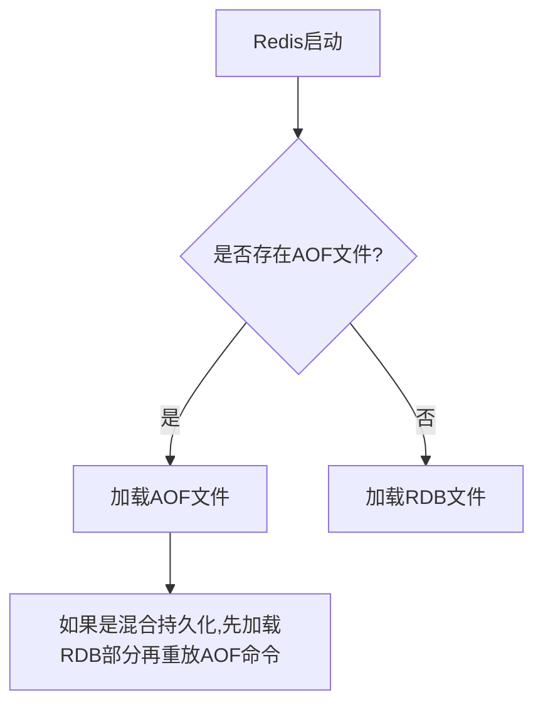

# redis


## redis的3种特殊数据结构介绍

### 1.Geospecial
#### 1.介绍，是什么
Redis的Geospatial（地理空间）功能是一组专门用于处理地理位置数据的命令，基于Redis的有序集合(Sorted Set)数据结构实现。
它允许你存储地理坐标（经度和纬度），并执行各种基于位置的计算和查询。
```redis
# GEOADD：添加一个或多个地理空间位置到指定的key中
GEOADD cities 13.361389 38.115556 "Palermo" 15.087269 37.502669 "Catania"
# GEOPOS：获取一个或多个位置的地理坐标
GEOPOS cities "Palermo" "Catania"
# GEODIST：计算两个位置之间的距离
GEODIST cities "Palermo" "Catania" km
# GEORADIUS：以给定的经纬度为中心，查找指定半径内的位置
GEORADIUS cities 15 37 100 km
# GEORADIUSBYMEMBER：以给定的成员为中心，查找指定半径内的位置
GEORADIUSBYMEMBER cities "Palermo" 200 km
# GEOHASH：获取一个或多个位置的Geohash值
GEOHASH cities "Palermo"
```
#### 2.应用场景
1. 附近的人/地点搜索：
  - 查找用户周围5公里内的餐厅
  - 显示附近的加油站或ATM机
  - 社交应用中查找附近的朋友

2. 配送和物流
 - 查找用户周围5公里内的餐厅 
 - 显示附近的加油站或ATM机

#### 3.底层的数据结构
Geospecial的底层数据结构是Zset(有序集合)

所有 GEO 命令实际上都是操作一个特殊的 Sorted Set：  
Key 对应 Sorted Set 的名称  
Member 是地点名称（如"北京"、"上海"）  
Score 是经过 Geohash 编码后的 52 位整数值  

Redis 使用 Geohash 将二维的经纬度转换为一维的分数(score)：  
经纬度标准化：  
经度范围 [-180,180] → 映射到 [0,2^32]  
纬度范围 [-90,90] → 映射到 [0,2^32]  

交替编码：   
将经度和纬度的二进制位交替排列   
例如：经度比特1 → 纬度比特1 → 经度比特2 → 纬度比特2 → ...  

生成52位整数：  
Redis 使用 52 位整数表示（对应 double 类型的精度）  
26位来自经度，26位来自纬度  

例如存储坐标（经度13.361389，纬度38.115556）：  
1.标准化坐标  
2.转换为二进制表示  
3.交替组合经度和纬度比特  
4.生成最终的52位整数作为Sorted Set的score  

为什么选择这种设计？ 

高效的范围查询：  
Geohash 具有"前缀相似性"：附近的位置有相似的hash值  
使用ZRANGEBYSCORE可以高效查询附近位置  

内存效率：
相比单独存储经纬度，使用一个score更节省空间
复用已有的Sorted Set数据结构

计算优化：
距离计算时可以直接解码出原始坐标
使用Haversine公式计算实际距离
### 2.hyperloglog  
#### 1.介绍，是什么
HyperLogLog 是 Redis 提供的一种概率性基数统计数据结构，用于高效地估计一个集合中不重复元素的数量（基数统计）。  

核心特点：  
极低的内存占用：统计上亿级别的基数只需约 12KB 内存  
固定内存消耗：无论统计多少元素，内存占用基本恒定  
概率性算法：有约 0.81% 的标准误差  
支持合并：多个 HyperLogLog 可以合并计算总基数  
#### 2.应用场景
1.大规模的uv统计 
 - 网站uv统计
 - 文章阅读量
 - 广告曝光
2.大数据去重
  - 搜索引擎：统计不同搜索查询的数量
  - 电商平台：统计不同搜索关键词的数量
  - 日志分析：统计不同错误类型的出现次数
#### 3.底层的数据结构
有两种编码格式来优化不同场景下的存储

基本工作流程  

1.哈希计算：对输入元素执行64位哈希（Redis使用MurmurHash64A）如果是稀疏矩阵，则使用32位哈希  
2.寄存器选择：前14位作为寄存器索引（2^14=16384个寄存器）  
3.前导零计数：计算剩余50位中第一个1出现的位置  
4.寄存器更新：如果新值大于当前寄存器值，则更新  

### 3.bitmap
#### 1.介绍，是什么
Redis的Bitmap实际上是基于String类型实现的，将字符串视为一个由二进制位组成的数组，每个位置可以存储0或1，用来处理二进制的数据
#### 2.应用场景
1. 横向统计 某一个用户存储多个状态值(不推荐)  
签到场景为例，用户的id为key，时间为offset偏移值，value为1代表签到，0代表未签到，但是这样维护起来很麻烦，每个用户都要维护一个bitmap  
2. 纵向统计 每个key值作为业务标识，offset为用户的uid (推荐)  
比如短视频平台，对每个视频的标识为key，然后uid作为偏移量，value为1代表该用户喜欢该视频，0代表不喜欢该视频  
3. 实现一个简单的布隆过滤器(利用位数组的特性)
#### 3.底层的数据结构
底层数据结构是String

假设执行
```bash
SETBIT mybitmap 10 1
```
内存中的实际存储情况
```text
字节偏移量：0        1
bit布局：  00000000 01000000
bit索引：  0-7      8-15
第10位被设为1
```

自动扩展机制：  
当设置的offset超过当前字符串长度时，Redis会自动扩展字符串并用0填充间隙    
扩展是以字节为单位的，即使只设置一个bit也可能导致多个字节的分配  

内存预分配：  
Redis采用预分配策略减少内存重分配次数  
每次扩展时可能会分配比实际需要更多的空间  

稀疏位图处理：  
对于非常大的offset，Redis会分配中间所有必要的字节  
这可能导致稀疏位图实际占用内存比预期大  

与普通String的异同

|特性|Bitmap视角|String视角 |
|----|----|----|
|存储内容	|二进制位数组|	字节数组 |
|访问方式	|按bit偏移量|	按字节偏移量|
|扩展单位	|bit(实际扩展字节)|	字节|
|典型操作	|位运算	|追加、截取等|

## redis的缓存更新策略

### 1.Cache Aside Pattern（旁路缓存模式）
这个模式是我们平常用的比较多的模式，比较适合读请求比较多的情况  

写操作  
1.先更新数据库  
2.然后直接删除cache  


读操作  
1.从 cache 中读取数据，读取到就直接返回    
2.cache 中读取不到的话，就从 db 中读取数据返回    
3.再把数据放到 cache 中。    

疑问点 
1.在写数据的过程中，可以先删除 cache ，后更新 db 么？ ·

不可以！很有可能发生缓存不一致的问题
```
请求 1 先把 cache 中的 A 数据删除 -> 请求 2 从 db 中读取数据-> 请求 1 再把 db 中的 A 数据更新
```
请求1先删除A的缓存，此时数据还没更新，这时候请求2从db中读取数据(此时请求1的数据库还没更新)，这个时候cache就会有数据了  
然后请求1中的db更新了，但是缓存已经存在了。就会导致redis的缓存是未更新的数据，mysql的数据是更新后的数据。

2.在写数据的过程中，先更新db，再删除redis的缓存，就一定没有问题吗？
```
请求 1 从 db 读数据 A-> 请求 2 更新 db 中的数据 A（此时缓存中无数据 A ，故不用执行删除缓存操作 ） 
-> 请求 1 将数据 A 写入 cache
```
目前在redis的cache中没有缓存，请求1从db中读数据，然后在redis写数据(在写数据之前mysql的db进行了更新，而且因为此时缓存中没有A，也不用删除)，这样的话，用的缓存数据就是更新前的数据了

但这种情况几乎不存在，因为reids在内存中写，会比mysql快很多。

缺陷 1：首次请求数据一定不在 cache 的问题解决办法：可以将热点数据可以提前放入 cache 中。  
缺陷 2：写操作比较频繁的话导致 cache 中的数据会被频繁被删除，这样会影响缓存命中率 。
解决办法：数据库和缓存数据强一致场景：更新 db 的时候同样更新 cache，不过我们需要加一个锁/分布式锁来保证更新 cache 的时候不存在线程安全问题。
可以短暂地允许数据库和缓存数据不一致的场景：更新 db 的时候同样更新 cache，但是给缓存加一个比较短的过期时间，这样的话就可以保证即使数据不一致的话影响也比较小。

### 2.Read/Write Through Pattern（读写穿透）
Read/Write Through 是一种将缓存作为主要数据访问层的设计模式，应用程序只与缓存交互，缓存系统自身负责与底层数据库的数据同步。

#### 1.读穿透 (Read Through)
应用程序直接向缓存请求数据  
如果缓存命中，直接返回数据  
如果缓存未命中：  
缓存系统自动从数据库加载数据  
将数据存入缓存  
返回给应用程序  

#### 2.写穿透 (Write Through)    
应用程序向缓存写入数据  
缓存系统先更新自身数据  
缓存系统同步将数据写入数据库  
返回写入结果给应用程序   

#### 3.架构图
```
 应用程序 → [ 缓存 ] ↔ 数据库
              ↖______ ↙
```
#### 4.优点分析
简化应用逻辑：应用不需要关心缓存与数据库的同步问题  
数据一致性：写操作保证缓存和数据库同步更新  
> 当应用程序执行 写操作（如更新数据） 时，缓存层（如 Redis）不会立即返回成功，而是会 同步等待数据库（如 MySQL）也更新完成，确保缓存和数据库的数据完全一致后，才向应用程序返回成功响应。
减少代码重复：避免在每个业务逻辑中重复缓存处理代码  

缺点与挑战
实现复杂度：需要封装缓存层，对现有架构改造较大  
写性能：每次写操作都需要等待数据库IO完成  
缓存系统依赖：缓存系统需要了解数据库schema  

适用场景  
读多写少的系统
需要强一致性的业务场景
希望简化应用层代码的项目
### 3.Write Behind Pattern（异步缓存写入）
Write Behind Caching 是一种以缓存为中心的高性能写入策略，其核心哲学是："先快速响应，后异步持久化"。这种模式将缓存视为事实上的数据源，而数据库则作为备份存储，通过异步方式保持最终一致性。
```
[应用程序] → [缓存层] ⇢ [异步队列] → [数据库]
```
写入路径：应用 → 缓存 → 确认响应 → (异步) → 数据库

读取路径：应用 ← 缓存 (始终从缓存读取最新数据)

写入过程  
1.应用发起写请求  
2.系统立即更新缓存数据  
3.记录变更到写缓冲区/队列  
4.立即返回成功响应  
5.后台线程定期批量处理缓冲区数据：  
6.合并相同key的多次更新  
7.批量写入数据库  
8.清理已处理的缓冲区条目  

读取过程  
1.应用发起读请求  
2.直接从缓存返回最新数据（无论是否已持久化到数据库）  

潜在挑战  
数据丢失风险：系统崩溃时未持久化的数据会丢失  
一致性妥协：无法保证数据库实时反映最新状态  
复杂度增加：需要处理故障恢复和缓冲区管理  
监控难度：需要额外监控缓存-数据库延迟  

适用场景  
写密集型系统：如点击流、日志收集  
允许数据丢失的场景：如实时统计、行为分析  
突发写入高峰：需要缓冲消峰的场景  
非关键业务数据：如社交媒体的点赞、浏览计数  

## redis的最终一致性

### (1) 延迟双删策略
```java
// 1. 先删除缓存
redis.del(key);
// 2. 更新数据库
db.update(data);
// 3. 休眠一段时间(如500ms)后再次删除缓存
Thread.sleep(500);
redis.del(key);
```
### (2) 基于消息队列的最终一致性
数据库更新后发送消息到MQ  
消费者接收消息删除缓存  
失败时可重试  

### (3) 基于binlog的同步

使用Canal等工具监听数据库binlog  
解析变更日志后删除/更新缓存  

### 选择策略的建议
强一致性要求：使用分布式锁+同步双写，但性能较低    
最终一致性可接受：Cache Aside + 延迟双删或消息队列  
读多写少：Read Through模式  
写多读少：Write Behind模式  

## redis持久化
我们使用reids，默认情况下redis的数据是保存在内存中的，当redis服务重启的时候，数据就会丢失，为了解决这个问题，redis提供了持久化的功能，将数据保存到磁盘中，当redis服务重启的时候，会从磁盘中加载数据，从而实现数据的持久化。

接下来主要介绍redis的两种持久化方式 RDB和AOF
### 1.RDB
RDB 是 Redis 的快照式持久化，它会定期将内存中的数据集生成一个二进制快照文件（默认名为 dump.rdb），保存到磁盘。

触发方式：
手动触发：通过 SAVE（阻塞）或 BGSAVE（后台异步）命令生成快照。  
自动触发：在配置文件中设置规则（如 save 900 1 表示 900 秒内至少 1 个键被修改时触发）。

优点：  
高性能：RDB 是二进制文件，恢复速度快。  
紧凑存储：文件体积小，适合备份和灾难恢复。    
最小化影响：BGSAVE 通过子进程操作，不影响主进程。  

缺点：  
可能丢失数据：如果 Redis 崩溃，最后一次快照后的数据会丢失。  
大数据量时耗时：生成快照可能占用较多 CPU 和内存。  

```conf 
save 900 1      # 15 分钟内至少 1 个键变化
save 300 10     # 5 分钟内至少 10 个键变化
save 60 10000   # 1 分钟内至少 10000 个键变化
dbfilename dump.rdb
dir ./          # 保存路径
```
### 2.AOF

AOF 记录所有写操作命令（如 SET、DEL），以追加方式写入文件（默认 appendonly.aof）。重启时通过重放命令恢复数据。

整体流程  
命令追加（append）：所有的写命令会追加到 AOF 缓冲区中。  
文件写入（write）：将 AOF 缓冲区的数据写入到 AOF 文件中。这一步需要调用write函数（系统调用），write将数据写入到了系统内核缓冲区之后直接返回了（延迟写）。注意！！！此时并没有同步到磁盘。  
文件同步（fsync）：AOF 缓冲区根据对应的持久化方式（ fsync 策略）向硬盘做同步操作。这一步需要调用 fsync 函数（系统调用）， fsync 针对单个文件操作，对其进行强制硬盘同步，fsync 将阻塞直到写入磁盘完成后返回，保证了数据持久化。  
文件重写（rewrite）：随着 AOF 文件越来越大，需要定期对 AOF 文件进行重写，达到压缩的目的。  
重启加载（load）：当 Redis 重启时，可以加载 AOF 文件进行数据恢复。  

可以类比为：  
文件写入：就像你把重要文件放在了办公桌抽屉里(内存)，拿取方便但不安全  
文件同步：就像你把文件锁进了保险柜(磁盘)，安全但存取麻烦  

同步策略（通过 appendfsync 配置）：  
always：每个命令都同步到磁盘，最安全但性能最低。  
everysec（默认）：每秒同步一次，平衡性能与安全。  
no：由操作系统决定同步时机，性能最好但可能丢失数据。  

优点：  
高耐久性：最多丢失 1 秒数据（everysec 配置时）。  
可读性：AOF 文件是文本格式，便于人工分析。  
自动重写：通过 BGREWRITEAOF 压缩冗余命令（如多次修改同一键）。  

缺点：  
文件更大：AOF 通常比 RDB 文件大。  
恢复慢：重放命令比加载 RDB 慢。  

```conf 
appendonly yes
appendfilename "appendonly.aof"
appendfsync everysec
auto-aof-rewrite-percentage 100  # AOF 文件增长 100% 时触发重写
auto-aof-rewrite-min-size 64mb   # AOF 文件最小重写大小
```

AOF的重写机制

AOF（Append Only File）会记录所有写操作命令（如 SET、DEL），随着运行时间增长，AOF 文件会变得越来越大，可能包含大量冗余命令（比如同一个键被多次修改，只有最后一次操作是有效的）。

AOF 重写的核心目的：  
1.压缩 AOF 文件体积，移除冗余命令，只保留最终数据状态所需的最小命令集。  
2.提升恢复速度：重写后的 AOF 文件更小，Redis 重启时重放命令更快。  

触发条件
```conf 
auto-aof-rewrite-percentage 100  # AOF 文件比上次重写后增长 100%（即翻倍）
auto-aof-rewrite-min-size 64mb   # AOF 文件至少达到 64MB 才触发重写
```

触发逻辑：  
Redis 会记录上一次重写后的 AOF 文件大小（如 64MB）。  
当当前 AOF 文件大小比上次重写后的体积 增长 100%（即达到 128MB）且文件大小超过 auto-aof-rewrite-min-size（64MB）时，自动触发重写。  

### 3.RDB+AOF 或者 RDB+AOP混合持久化

#### 方案一：同时开启 RDB + AOF

工作方式：  
定期生成 RDB 快照  
同时持续追加 AOF 日志  

优势：  
RDB 作为基础备份，AOF 作为增量补充  
灾难恢复时：先用 RDB 恢复基础数据，再用 AOF 重放最近操作   
双重保障，安全性更高  

#### 方案二：RDB-AOF 混合持久化（Redis 4.0+）  

工作方式：  
AOF 文件由两部分组成：  
前半部分：RDB 格式的全量数据  
后半部分：增量 AOF 格式的命令  

实际应用建议
数据安全性要求极高：
配置：appendfsync always + 定期 RDB
代价：性能影响最大

平衡安全与性能：
配置：appendfsync everysec + 混合持久化
推荐：大多数生产环境的折中选择

优势：  
兼具 RDB 的快速恢复和 AOF 的数据完整性   
文件体积比纯 AOF 小   
恢复速度比纯 AOF 快  


整体的恢复流程


### 4.如何选择RBD和AOF

1.一般推荐使用单独的RDB 持久化（如果允许部分数据丢失）  

因为RDB存放的是压缩过的二进制的数据，保存着某个时间点的数据，文件很小，而且恢复数据数据的时候直接解析还原数据即可，恢复起来更快。  
如果是AOF的话，需要一条一条的解析命令，文件的内容也会偏大，而且如果数据量大，redis的重写AOF文件的时候，会消耗一定的内存  

2.AOF的的优势  
aof的操作，更加轻量化一点，每秒写入一次   
.rdb文件对于老版本会不兼容，数据迁移可能会有问题，但是AOF文件没这个问题  
AOF 以一种易于理解和解析的格式包含所有操作的日志。你可以轻松地导出 AOF 文件进行分析，你也可以直接操作 AOF 文件来解决一些问题。比如，如果执行FLUSHALL命令意外地刷新了所有内容后，只要 AOF 文件没有被重写，删除最新命令并重启即可恢复之前的状态。

3.如果要使用rdb，不要只使用rdb，因为时不时地创建一个 RDB 快照可以进行数据库备份、更快的重启以及解决 AOF 引擎错误。  

4.如果保存的数据要求安全性比较高的话，建议同时开启 RDB 和 AOF 持久化或者开启 RDB 和 AOF 混合持久化  
  
## redis事务 + Lua脚本

### redis事务介绍
这块了解即可，不用深度学习。  
Redis 事务是一种将多个命令打包执行的机制，确保这些命令按顺序、一次性、原子性地执行（但非严格意义上的ACID事务）。它通过 MULTI、EXEC、DISCARD 和 WATCH 等命令实现。

(1) 基本事务流程  

1.MULTI  
标记事务开始，后续命令会放入队列，而非立即执行。
```bash
> MULTI
OK
```

2.命令入队
输入的命令会按顺序缓存到队列中，返回 QUEUED 表示成功入队。
```bash
> SET key1 "value1"
QUEUED
> INCR key2
QUEUED
EXEC
```
3.执行事务队列中的所有命令，返回每个命令的结果。

```bash
> EXEC
1) OK       # SET key1 "value1" 的结果
2) (integer) 1  # INCR key2 的结果
OK
```

4.DISCARD
取消事务，清空队列，不执行任何命令。
```bash
> DISCARD
OK
```


(2) 事务的原子性  

Redis 事务是原子性的：所有命令在 EXEC 时一次性执行，不会被其他客户端命令打断。  
但无回滚机制：如果某个命令失败（如语法错误），其他命令仍会执行（与关系型数据库不同）。  

示例
```bash
> MULTI
OK
> SET key1 "value1"
QUEUED
> INCR key1  # 错误：对字符串执行INCR
> set key2 "value2" 
QUEUED
> EXEC
1) OK        # SET 成功
2) (error) ERR value is not an integer  # INCR 失败，但SET已生效
3) OK         # SET key2 成功，第二个报错不影响第三个成功
```

(3) 乐观锁：WATCH 命令

Redis 通过 WATCH 实现乐观锁（CAS，Check-And-Set），用于监控键的变化，防止事务执行期间数据被修改。

如果 WATCH 的键在 MULTI 和 EXEC 之间被修改，事务会自动放弃（返回 nil）。

完整示例流程参考
```bash
> WATCH stock
OK
> MULTI
OK
> DECR stock
QUEUED
> EXEC  # 如果 stock 未被其他客户端修改，事务成功
```

(4) 总结  

Redis 事务通过 MULTI/EXEC 实现批量命令原子执行，但无回滚。

WATCH 提供乐观锁机制，防止数据竞争。

适合简单场景，不适合复杂事务需求（需结合 Lua 脚本增强）。


### Lua脚本

Lua脚本呢，就是把redis的操作整合在一个命令里面了，和事务不同，事务是把要执行的多个任务一个一个放到队列里面，然后一起执行，Lua脚本就是执行一个任务。

学习会基础的Lua脚本

```Lua
-- 变量声明(无需类型声明)
local name = "Alice"  -- 字符串
local age = 30        -- 数字
local isJavaDev = true -- 布尔
local scores = {90, 85, 95} -- 表(类似Java的数组/Map)

-- 注意: Lua中索引从1开始!
print(scores[1]) -- 输出90

-- if语句
if age > 18 then
    print("成年人")
elseif age > 12 then
    print("青少年")
else
    print("儿童")
end

-- for循环
for i = 1, 5 do
    print("计数: " .. i)  -- .. 是字符串连接
end

-- while循环
local count = 0
while count < 3 do
    print("while循环: " .. count)
    count = count + 1
end

-- 定义函数
function add(a, b)
    return a + b
end

-- 调用函数
local result = add(5, 3)
print("5 + 3 = " .. result)

```

简单调用实战

Lua脚本如下
```lua
-- 简单示例: 设置并获取值
local key = KEYS[1]  -- 获取第一个键参数
local value = ARGV[1] -- 获取第一个值参数
redis.call("SET", key, value)
return redis.call("GET", key)
```
实际在redis-cli的操作与讲解
```redis
# EVAL 就是代表着执行这个脚本
# 1 表示 KEYS 数组的长度，mykey 表示 KEYS 数组中的第一个元素，hello 表示 ARGV 数组中的第一个元素
# KEYS[1] 表示 mykey, ARGV[1] 表示 hello
EVAL "local key = KEYS[1] local value = ARGV[1] redis.call('SET', key, value) return redis.call('GET', key)" 1 mykey "hello"
```

直接在java中写逻辑和使用Lua脚本的优劣

先简单的实现一个限流器

```lua 
local key = KEYS[1]
local time = tonumber(ARGV[1])
local count = tonumber(ARGV[2])
local current = redis.call('get',key)
if current and tonumber(current)>count then    
　　return tonumber(current)
end
current = redis.call('incr', key)
if tonumber(current)==1 then    
　　redis.call('expire',key,time)
end
return tonumber(current)
```

```Java
public boolean isExceedLimit(String key, int expireSeconds, int limit) {
    // 1. 获取当前计数
    Long current = redisTemplate.opsForValue().increment(key, 1);
    
    // 2. 首次请求设置过期时间
    if (current != null && current == 1) {
        redisTemplate.expire(key, expireSeconds, TimeUnit.SECONDS);
    }
    
    // 3. 判断是否超限
    if (current != null && current > limit) {
        return true; // 触发限流
    }
    return false;
}
```

结论：Java 实现的局限性

在分布式高并发环境中，Java 实现存在两大根本问题：  

时间窗口漂移：  

多个请求可能设置过期时间  
导致实际时间窗口长度不稳定  

永久键风险：  

当第一个请求设置过期时间失败时  
键可能变为永久存在  
导致永久性限流故障  

何时使用 Java 实现：  

低并发场景
允许少量计数误差  
有外部监控可检测永久键问题  
无法使用 Lua 脚本的环境  

Lua 解决的核心问题：

真正的原子操作：

检查计数 → 自增 → 设置过期时间 在单次操作中完成  
无并发干扰可能  

精确的首次判断：
 
if tonumber(current) == 1 在自增后判断  
确保只有一个请求设置过期时间  

超限提前返回：  
如果已超限，不执行自增操作  
避免无效计数增加  

总结：

| **考虑维度**       | **Lua脚本**                              | **Java实现**                            |
|--------------------|------------------------------------------|-----------------------------------------|
| **原子性**         | ✅ 完美保证                               | ❌ 需额外手段（事务、分布式锁）          |
| **网络开销**       | ✅ 极低（1次往返）                        | ❌ 高（多次往返）                        |
| **Redis阻塞风险**  | ⚠️ 可能（脚本过长时）                     | ✅ 低（每个命令快速）                    |
| **开发调试**       | ❌ 困难                                   | ✅ 简单（集成IDE、日志）                 |
| **可维护性**       | ⚠️ 中（需管理脚本版本）                   | ✅ 高（Java代码易管理）                 |
| **兼容性**         | ⚠️ 依赖Redis版本和集群设置                | ✅ 高（命令通用）                        |
| **错误处理**       | ❌ 脚本出错影响大                         | ✅ 灵活（可捕获异常重试）                |
| **适用场景**       | 高并发、原子性要求高、网络延迟大的场景    | 低频、简单逻辑、需要与业务紧密集成的场景|


