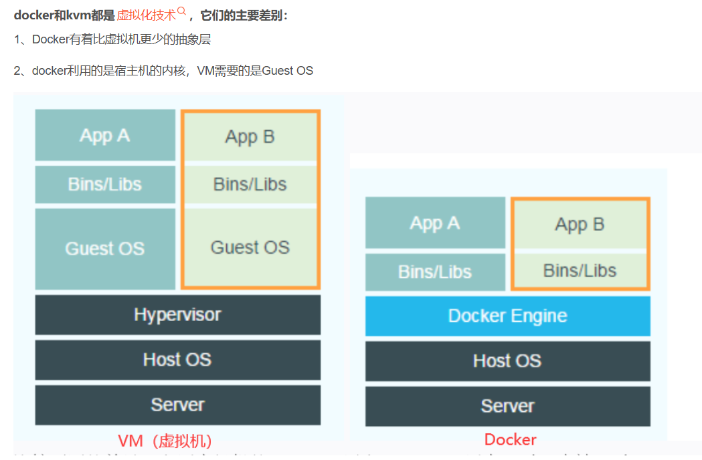

# docker

## docker的介绍
docker是一种容器,利用的是宿主机的内核,而常见的虚拟化技术是重新搭建一个操作系统


## docker工作机制与核心概念
容器（Container）
容器是一个轻量级的、独立的软件包，包含运行应用所需的代码、依赖库、环境变量和配置文件。
容器共享宿主机的操作系统内核，但通过隔离机制（如命名空间、cgroups）实现进程、文件系统、网络等的独立。

镜像（Image）
镜像是容器的静态模板，定义了容器的初始状态（类似操作系统的安装光盘）。
镜像通过分层存储（Layer）实现高效复用，例如一个基础镜像（如 Ubuntu）可以被多个应用镜像共享。
Dockerfile

用于定义镜像构建过程的脚本文件，通过逐行指令（如 FROM, COPY, RUN）自动化构建镜像。


## 常用命令
### 镜像管理
```shell

docker pull <镜像名>:<标签>  # 拉取镜像 默认标签为 latest
docker pull nginx:latest

docker images # 查看本地镜像

docker build -t <镜像名>:<标签> <Dockerfile路径>
# 示例（当前目录的 Dockerfile）
docker build -t myapp:v1 .

docker rmi <镜像名或ID>
# 强制删除（即使有容器在使用）
docker rmi -f <镜像名或ID>

docker push <镜像名>:<标签>
# 示例（需先登录 Docker Hub）
docker push myusername/myapp:v1
```
### 容器管理
```shell
docker run [选项] <镜像名>
# 常用选项：
# -d: 后台运行
# -p <宿主机端口>:<容器端口>: 端口映射
# -v <宿主机目录>:<容器目录>: 挂载数据卷
# --name: 指定容器名称
# -e: 设置环境变量
# --rm: 容器退出后自动删除

# 示例
docker run -d -p 80:80 --name mynginx nginx
docker run -it --rm ubuntu:20.04 /bin/bash  # 临时进入Ubuntu容器

docker ps      # 查看运行中的容器
docker ps -a   # 查看所有容器（包括已停止的）

docker start <容器名或ID>
docker stop <容器名或ID>
docker restart <容器名或ID>

docker exec -it <容器名或ID> <命令>
# 示例（进入容器并启动交互式终端）
docker exec -it mynginx /bin/bash

docker logs <容器名或ID>
docker logs -f <容器名或ID>  # 实时跟踪日志

docker rm <容器名或ID>
docker rm -f <容器名或ID>  # 强制删除运行中的容器
```
### 数据卷相关
```shell
docker run -d --name <容器名> -v <宿主机目录>:<容器目录> <镜像>
docker run -d --name web -v /opt/wwwroot:/usr/share/nginx/html nginx:latest
```

### dockerFile相关
```shell

```
### docker compose相关
```shell
docker-compose up -d  # 后台启动
docker-compose down
docker-compose ps
docker-compose up --build 
```

### 常见示例参考
```shell
# 运行一个MySQL容器
docker pull mysql:8.3.0
mkdir -p  /home/mysql/{conf,data,log}

docker run \
-p 3306:3306 \
--restart=always \
--name mysql \
--privileged=true \
-v /home/mysql/log:/var/log/mysql \
-v /home/mysql/data:/var/lib/mysql \
-v /home/mysql/conf/my.cnf:/etc/mysql/my.cnf \
-e MYSQL_ROOT_PASSWORD=a12bCd3_W45pUq6 \
-d mysql:8.3.0  
```
### 好文章
优质汇总  
https://docker-practice.github.io/zh-cn/introduction/
